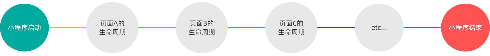

# 总结

①能够知道如何实现页面之间的导航跳转

- 声明式导航、编程式导航

②能够知道如何实现下拉刷新效果

- enablePullDownRefresh、onPullDownRefresh

③能够知道如何实现上拉加载更多效果

- onReachBottomDistance、onReachBottom

④能够知道小程序中常用的生命周期函数

- 应用生命周期函数：onLaunch, onShow, onHide
- 页面生命周期函数：onLoad, onShow, onReady, onHide, onUnload


# 页面导航

## 1.1 概述

页面导航指的是 页面之间的相互跳转 。例如，浏览器中实现页面导航的方式有如下两种：

① `<a>` 链接

② location.href

## 1.2 页面导航的两种方法

① 声明式导航

- 在页面上声明一个` <navigator>` 导航组件
- 通过点击 `<navigator>` 组件实现页面跳转

② 编程式导航

- 调用小程序的导航 APIAPI，实现页面的跳转

### 1.2.1 声明式导航-跳转至 tabBar 页面

在使用 ` <navigator> ` 组 件跳转到指定的 `tabBar` 页面时，需要指定 url 属性和 openopen-type 属性，其中：

- url 表示要跳转的 页面的地址 ，必须以 /开头
- openopen-type 表示 跳转的方式 ，必须为 switchTab示

```html
<navigator url="/pages/message/message" open-type="switchTab">导航到消息页面</navigator>
```

### 1.2.2 导航到非 tabBar 页面

非 tabBar 页面 指的是没有被配置为 tabBar 的页面。
在使用 `<navigator>` 组件跳转到普通的非 tabBar 页面时，则需要指定 url 属性和 openopen-type 属性，其中：

- url 表示要跳转的 页面的地址 ，必须以 /开头
- openopen-type 表示 跳转的方式 ，必须为 navigate

示例代码如下：

```html
<navigator url="/pages/info/info" open-type="navigate">导航到info页面</navigator>
```

::: details 声明式导航传参

navigator组件的 url 属性用来指定将要跳转到的页面的路径。同时， 路径的后面还可以携带参数 ：

- 参数 与路径 之间使用 ?分隔
- 参数键 与参数值 用 =相连
- 不同参数 用 &分隔

:::


::: tip 注意：

为了简便，在导航到非 tabBar 页面时， open -type=type="navigate"属性 可以省略 。

:::

### 1.2.3 后退导航

如果要后退到上一页面或多级页面，则需要指定openopen-type 属性和 delta 属性，其中：

- openopen-type 的值必须是 navigateBack ，表示要进行后退导航
- delta 的值必须是 数字 ，表示要后退的层级

示例代码如下：

```html
<navigator open-type="navigateBack" delta='1'>返回上一页</navigator>
```

::: tip 注意：

为了简便，如果只是后退到上一页面，则可以省略 delta 属性 ，因为其默认值就是 1。

:::

### 1.2.4 编程式导航 - 跳转到 tabBar  页面

调用 wx.switchTab(Object object object)方法，可以跳转到 tabBar 页面。其中 Object 参数对象 的属性列表如下：

|     属性     |    类型    | 必填 |                             说明                             |
| :----------: | :--------: | :--: | :----------------------------------------------------------: |
|   **url**    |  `string`  |  是  | 需要跳转的 tabBar 页面的路径（需在 `app.json` 的 `tabBar` 中定义），路径后不能带参数。 |
| **success**  | `function` |  否  |                   接口调用成功的回调函数。                   |
|   **fail**   | `function` |  否  |                   接口调用失败的回调函数。                   |
| **complete** | `function` |  否  |      接口调用结束的回调函数（调用成功、失败都会执行）。      |

示例代码如下：

```
// 页面结构
<button bindtap="gotoMessage">跳转到消息页面</button>

// 编程式导航跳转
gotoMessage() {
  wx.switchTab({
    url: '/pages/message/message'
  })
}
```

### 1.2.5  编程式导航 - 导航到非  tabBar  页面

|     属性     |    类型    | 必填 |                             说明                             |
| :----------: | :--------: | :--: | :----------------------------------------------------------: |
|   **url**    |  `string`  |  是  | 需要跳转的 tabBar 页面的路径（需在 `app.json` 的 `tabBar` 中定义），路径后可以带参数。 |
| **success**  | `function` |  否  |                   接口调用成功的回调函数。                   |
|   **fail**   | `function` |  否  |                   接口调用失败的回调函数。                   |
| **complete** | `function` |  否  |      接口调用结束的回调函数（调用成功、失败都会执行）。      |

```
<button bindtap="gotoMessage">跳转到info页面</button>

gotoMessage() {
  wx.navigateTo({
    url: '/pages/message/message'
  })
}
```

::: details 编程式导航传参

调用 wx.navigateTo()方法时，也可以携带参数跳转：

```
<button bindtap="gotoInfo2">跳转到info页面</button>

gotoInfo2() {
  wx.navigateTo({
    url: '/pages/info/info?name=ls&gender=男'
  })
}
```

:::

::: details 编程式导 - onLoad 中接收导航参数

通过声明导航传参或编程式导航传参所携带的参数，可以直接在 onLoad 实践中直接获取到：

```
/**
 * 生命周期函数--监听页面加载
 */
onLoad: function(options) {
  // options 就是导航传递过来的参数对象
  console.log(options)
}
```

:::


###1.2.6 编程式导航 - 后退导航

调用 wx.navigateBack(Object object object)方法，可以返回上一页面或多级页面。其中 Object 参数对象可选的属性列表如下：

|     属性     |    类型    | 必填 |                          说明                           |
| :----------: | :--------: | :--: | :-----------------------------------------------------: |
|  **delta**   |  `string`  |  是  | 返回的页面数，如果 delta 大于现有页面数，则返回到首页。 |
| **success**  | `function` |  否  |                接口调用成功的回调函数。                 |
|   **fail**   | `function` |  否  |                接口调用失败的回调函数。                 |
| **complete** | `function` |  否  |   接口调用结束的回调函数（调用成功、失败都会执行）。    |

```
// 页面结构
<button bindtap="gotoBack">跳转到消息页面</button>

// 编程式导航,后退到上一页或多页
gotoBack() {
  wx.navigateBack()
}
```


# 页面事件

## 下拉刷新

下拉刷新是移动端的专有名词，指的是通过手指在屏幕上的下拉滑动操作，从而重新加载页面数据的行为。

### 1.1 启用方式：

启用下拉刷新有两种方式：
① 全局开启下拉刷新

- 在 app.json 的 window 节点中，将 enablePullDownRefresh 设置为 true

② 局部开启下拉刷新

- 在页面的 .json 配置文件中，将 enablePullDownRefresh 设置为 true

在实际开发中，推荐使用第 2 种方式， 为需要的页面单独开启下拉刷新的效果 。

### 1.2 下拉窗口样式

在全局或页面的 .json 配置文件中，通过 backgroundColor 和 backgroundTextStyle 来配置下拉刷新窗口 的样式，其中：

- backgroundColor 用来配置下拉刷新 窗口的背景颜色 ，仅支持 16 进制的颜色值
- backgroundTextStyle 用来配置下拉刷新 loading 的样式 ，仅支持 dark 和 light

### 1.3 监听页面的下拉刷新事件

在页面的 .js 文件中，通过 onPullDownRefresh() 函数即可监听当前页面的下拉刷新事件。

例如，在页面的 wxml 中有如下的 UI 结构，点击按钮可以让 count 值自增 +1 ：

```html
// 页面结构
<view>count值为: {{count}}</view>
<button bindtap="countAdd">+1</button>

// +1 按钮的点击事件处理函数
countAdd() {
  this.setData({
    count: this.data.count + 1
  })
}
```

在触发页面的下拉刷新事件的时候，如果要把count 的值重置为 0：

```js
/**
 * 页面相关事件处理函数--监听用户下拉动作
 */
onPullDownRefresh: function () {
  this.setData({
    count: 0
  })
}
```

### 1.4 停止下拉刷新

当处理完下拉刷新后，下拉刷新的`loading`效果会一直显示， 不会主动消失 ，所以需要手动隐藏下拉刷新的`
loading`效果。

此时，调用 wx.stopPullDownRefresh() 可以停止当前页面的下拉刷新：

```js
/**
 * 页面相关事件处理函数--监听用户下拉动作
 */
onPullDownRefresh: function () {
  this.setData({
    count: 0
  })
  // 当数据重置成功之后, 调用此函数, 关闭下拉刷新的效果
  wx.stopPullDownRefresh()
}
```

## 上拉触底

上拉触底 是移动端的专有名词，通过手指在屏幕上的上拉滑动操作，从而 加载更多数据 的行为。

在页面的 .js 文件中，通过 onReachBottom() 函数即可监听当前页面的上拉触底事件：

```js
/**
 * 页面上拉触底事件的处理函数
 */
onReachBottom: function () {
  console.log('触发了上拉触底的事件')
}
```

### 配置上拉触底距离

上拉触底距离指的是 触发上拉触底事件时，滚动条距离页面底部的距离 。

可以在全局或页面的 .json 配置文件中，通过 onReachBottomDistance 属性来配置上拉触底的距离。

小程序默认的触底距离是50px ，在实际开发中，可以根据自己的需求修改这个默认值。

# 生命周期

## 概述

生命周期（Life Cycle Cycle）是指一个对象从 创建 -> 运行 -> 销毁 的整个阶段， 强调的是一个时间段 。例如：

- 张三 出生 ，表示这个人 生命周期的开始
- 张三 离世 ，表示这个人 生命周期的结束
- 中间张三的一生，就是张三的生命周期

我们可以把每个小程序运行的过程，也概括为生命周期：

- 小程序的 启动 ，表示 生命周期的开始
- 小程序的 关闭 ，表示 生命周期的结束
- 中间小程序运行的过程，就是小程序的生命周期

## 生命周期的分类

在小程序中，生命周期分为两类，分别是：
① 应用生命周期

- 特指小程序从启动 -> 运行 -> 销毁的过程

② 页面生命周期

- 特指小程序中，每个页面的加载 -> 渲染 -> 销毁的过程

其中， 页面的生命周期范围较小，应用程序的生命周期范围较大：



## 生命周期函数

生命周期函数：是由小程序框架提供的内置函数，会伴随着生命周期自动按次序执行 。

生命周期函数的作用：允许程序员在特定的时间点 ，执行某些特定的操作。例如，页面刚加载的时候，可以在 onLoad 生命周期函数中初始化页面的数据。

::: tip 注意：

生命周期 强调的是 时间段，生命周期函数强调的是时间点 。

:::

小程序中的生命周期函数分为两类，分别是：

① 应用的生命周期函数

- 特指小程序从启动 -> 运行 -> 销毁期间依次调用的那些函数：

  ```js
  // app.js 文件
  App({
    // 小程序初始化完成时,执行此函数,全局只触发一次。可以做一些初始化的工作。
    onLaunch: function(options) { },
    // 小程序启动,或从后台进入前台显示时触发。
    onShow : function(options) { },
    // 小程序从前台进入后台时触发。
    onHide : function() { }
  })
  ```

② 页面的生命周期函数

- 特指小程序中，每个页面从加载 -> 渲染 -> 销毁期间依次调用的那些函数

  ```js
  // 页面的 .js 文件
  Page({
    onLoad : function(options) { }, // 监听页面加载, 一个页面只调用1次
    onShow : function() { },
    onReady : function() { }, // 监听页面初次渲染完成, 一个页面只调用1次
    onHide : function() { }, // 监听页面隐藏
    onUnload: function() { } // 监听页面卸载, 一个页面只调用1次
  8 })
  ```

# wxs 脚本

## 概述

WXS （WeiXin Script Script）是 小程序独有的一套脚本语言 ，结合 WXML ，可以构建出页面的结构。

wxml中无法调用在页面的 .js 中定义的函数， 但是wxml 中可以调用 wxs 中定义的函数。因此，小程序中wxs 的典型应用场景 就是“ 过滤器 ”。

虽然 wxs 的语法类似于 JavaScriptJavaScript，但是 wxs 和 JavaScript 是完全不同的两种语言：

① wxs 有自己的数据类型

- number 数值类型、 string 字符串类型、 boolean 布尔类型、 object 对象类型、
- function 函数类型、 array 数组类型、 date 日期类型、 regexp 正则

② wxs 不支持类似于 ES6 及以上的语法形式

- 不支持 ：let 、const 、解构赋值、展开运算符、箭头函数、对象属性简写、 etc...
- 支持 ：var 定义变量、普通 function 函数等类似于 ES5 的语法

③ wxs 遵循 CommonJS 规范

- module 对象
- require() 函数
- module.exports 对

## 基础语法

### 1. 内嵌 wxs 脚本

wxs代码可以编写在 wxml 文件中的 `<wxs>` 标签内，就像 Javascript 代码可以编写在 html 文件中的 `<script>`
标签内一样。
wxml文件中的每个` <wxs>` `</wxs>` 标签， 必须提供 module 属性 ，用来指定 当前 wxs 的模块名称 ，方便在 wxml 中访问模块中的成员：

```vue
<template>
  <view>{{m1.toUpper(username)}}</view>
</template>

<script module="m1" lang="wxs">
// 将文本转为大写形式 zs -> ZS
module.exports.toUpper = function(str) {
  return str.toUpperCase()
}
</script>
```

### 2. 定义外联的 wxs 脚本

wxs代码还可以编写在 以 .wxs 为后缀名的文件内 ，就像 javascript 代码可以 编写在.js 为后缀名的文件中 一样：

```js
// tools.wxs 文件
function toLower(str) {
    return str.toLowerCase()
}

module.exports = {
    toLower: toLower
}
```


### 3. 使用外联的 wxs 脚本

在 wxml 中引入外联的 wxs 脚本时， 必须为 `<wxs>` 标签添加 module 和 src 属性，其中：

- module 用来指定模块的名称

- src 用来指定要引入的脚本的路径，且必须是相对路径

  ```vue
  <!-- 调用 m2 模块中的方法 -->
  <view>{{m2.toLower(country)}}</view>
  
  <!-- 引用外联的 tools.wxs 脚本，并命名为 m2 (本身不参与渲染) -->
  <wxs src="../../utils/tools.wxs" module="m2"></wxs>
  ```

  

## wxs 的特点

1. 与 js 不同之处

   为了降低 wxswxs（WeiXin Script ）的学习成本 wxs 语言在设计时借大量鉴了 JavaScript 的语法。但是本质上，wxs 和 JavaScript 是完全不同的两种语言！

2. 不能作为组件的事件回调：

   wxs典型的应用场景就是“过滤器”，经常配合 Mustache 语法进行使用：

   ```
   <view>{{ m2.toLower(country) }}</view>
   ```

   在微信小程序的 **WXML 模板** 中，像 `country` 这样的变量可以直接使用（不需要写 `this.country`），是因为 WXML 的数据绑定机制会自动从当前页面的 **`data` 对象** 中查找该变量。这是小程序框架的设计特性，与 Vue（组合式api）等前端框架的数据绑定逻辑类似。

   但是，在 wxs 中定义的函数不能作为组件的事件回调函数 。因此，下面的用法是错误的：

   ```
   <button bindtap="m2.toLower">按钮</button>
   ```

3. 隔离性

   隔离性指的是 wxs 的运行环境和其他 JavaScript 代码是隔离的。体现在如下两方面：
   ① wxs 不能调用 js 中定义的函数

   ② wxs 不能调用小程序提供的 API

4. 性能好

   - 在 iOS 设备 上，小程序内的 WXS 会比 JavaScript 代码 快 2 ~ 20 倍
   - 在 android 设备 上，二者的运行效率

# 案例 - 本地生活

## wx-for vs v-for

```html
<view class="shop-item" wx:for="{{shopList}}" wx:key="id">
  <view class="thumb">
    <image src="{{item.images[0]}}"></image>
  </view>
  <view class="info">
    <text>{{item.name}}</text>
    <text>电话: {{item.phone}}</text>
    <text>地址: {{item.address}}</text>
    <text>营业时间: {{item.businessHours}}</text>
  </view>
</view>
```

在微信小程序的 `wx:for` 循环中，`wx:key` 的值可以是字符串，当使用类似 `wx:key="id"` 这种写法时，前提是当前循环项（这里是 `item` ，由 `wx:for="{{shopList}}"` 遍历 `shopList` 得到）本身有一个名为 `id` 的属性 。

如果 `shopList` 数组中的每个对象都有 `id` 属性，并且这个 `id` 是唯一标识每个对象的，那么 `wx:key="id"` 是正确的写法，它会告诉小程序框架每个列表项的唯一标识是其自身的 `id` 属性值，这有助于提高列表渲染的性能和更新时的准确性等。

而 `wx:key="item.id"` 这种写法一般是不正确的，因为 `wx:key` 的值通常是基于当前作用域下的变量直接取值，而不是通过 `item.xxx` 这种形式来指定（除非是在特定的复杂表达式等场景下，但常规列表渲染不建议这么用）。所以如果数据结构支持，`wx:key="id"` 是合理且常用的方式。

我记得 vue  中 v-for : key = item.id，Vue 中的 `v-for` 写法是正确的：

```
<div v-for="item in shopList" :key="item.id">
  <!-- 内容 -->
</div>
```

这里 `:key="item.id"` 表示使用 `item` 对象的 `id` 属性作为唯一标识。

而在 **微信小程序** 的 `wx:for` 中，`wx:key` 的写法稍有不同：

1. **如果 `shopList` 中的每个 `item` 都有 `id` 属性**

可以直接用 `wx:key="id"`，因为小程序会自动从当前项（`item`）中取 `id` 属性：

```
<view wx:for="{{shopList}}" wx:key="id">
  <!-- 内容 -->
</view>
```

这相当于 Vue 的 `:key="item.id"`，但写法更简洁。

2. **如果 `id` 不是直接属性，或者需要更复杂的表达式**

小程序也支持类似 Vue 的写法，但要用 `{{}}` 包裹表达式：

```
<view wx:for="{{shopList}}" wx:key="index">  <!-- 使用索引作为 key（不推荐，除非没有唯一 id） -->
  <!-- 内容 -->
</view>

<!-- 或者使用自定义表达式（但小程序不支持直接写 item.id，需要额外处理） -->
<!-- 小程序不支持 wx:key="item.id"，但可以通过计算属性或预处理数据解决 -->
```

如果 `id` 不是直接属性，或者需要更复杂的逻辑，通常建议：

- **在 JS 中预处理数据**，确保每个 `item` 都有 `id` 属性。
- **使用 `index` 作为 `key`**（不推荐，除非数据不会动态变化，否则可能导致渲染问题）。

**总结对比**

|          框架          |             写法              |                   说明                   |
| :--------------------: | :---------------------------: | :--------------------------------------: |
|        **Vue**         |       `:key="item.id"`        |    直接指定 `item` 的 `id` 作为 `key`    |
|       **小程序**       |         `wx:key="id"`         |      自动从当前 `item` 取 `id` 属性      |
| **小程序（复杂情况）** | `wx:key="index"` 或预处理数据 | 如果 `id` 不是直接属性，可能需要额外处理 |

所以，我的记忆是正确的，Vue 的 `v-for` 确实需要 `:key="item.id"`，而小程序的 `wx:for` 可以更简洁地写成 `wx:key="id"`（前提是 `item` 有 `id` 属性）。

## 页面中的下拉触底设置

`页面文件夹中的.js文件`：

```js
/**
 * 页面上拉触底事件的处理函数
 */

onReachBottom: function () {
    if(this.data.isloading) return  // 防抖节流
    // 判断数据是否已经加载完
    if(this.data.page * this.data.pageSize >= this.data.total) {
      // 说明数据已加载完
      return wx.showToast({
        title:'已加载全部数据！',
        icon:'none'
      })
    }
  	
    this.setData({
        page: this.data.page + 1
    })
    this.getShopList()
},
```

## 判断是否还有下一页数据的公式

如果下面的公式成立,则证明没有下一页数据了:

页码值 * 每页显示多少条数据 >= 总数据条数
page * pageSize >= total

案例1: 总共有 77 条数据,如果每页显示 10 条数据,则总共分为 8 页,其中第 8 页只有 7 条数据

page (7) * pageSize (10) >= total (77)
page (8) * pageSize (10) >= total (77)

案例2: 总共有 80 条数据,如果每页显示 10 条数据,则总共分为 8 页,其中第 8 页面有 10条数据

page (7) * pageSize (10) >= total (80)
page (8) * pageSize (10) >= total (80)

## 下拉刷新效果

页面文件夹中的`.json`文件：

```json
{
  // 定义页面中所使用到的自定义组件，目前为空对象，表示未使用自定义组件
  "usingComponents": {},
  // 页面上拉触底事件触发时距页面底部的距离，单位为px，这里设置为200px
  "onReachBottomDistance": 200,
  // 是否开启下拉刷新功能，true表示开启，false表示关闭，这里开启
  "enablePullDownRefresh": true,
  // 窗口的背景色，采用十六进制颜色值表示，这里是浅灰色(#efefef)
  "backgroundColor": "#efefef",
  // 下拉刷新时窗口的背景文字样式，可选值为light（白色）和dark（黑色），这里是dark（黑色）
  "backgroundTextStyle": "dark"
}
```

页面文件夹中的`.js`文件：

```js
  /**
   * 页面相关事件处理函数--监听用户下拉动作
   */
  onPullDownRefresh: function () {
    // 需要重置关键的数据
    this.setData({
      page: 1,
      shopList: [],
      total: 0
    })
    // 重新发起数据请求
    this.getShopList(() => {
      wx.stopPullDownRefresh()
    })
  },
```

其中：

**`this.getShopList(() => { wx.stopPullDownRefresh() })` 相当于给 `getShopList` 传递了一个回调函数参数**

**1. 代码解析**

- **`this.getShopList(() => { wx.stopPullDownRefresh() })`**
  - 这里向 `getShopList` **传入了一个箭头函数** `() => { wx.stopPullDownRefresh() }` 作为参数。
  - 这个箭头函数会在 `getShopList` **内部被调用**（如果 `getShopList` 支持回调的话）。
- **相当于给 `getShopList` 传递了一个回调参数**
  - 这意味着 `getShopList` **必须定义一个参数（通常命名为 `cb` 或 `callback`）来接收这个函数**，并在适当的时候（如请求完成后）调用它。

------

**2. `getShopList` 的正确实现方式**

如果希望 `wx.stopPullDownRefresh()` 能被执行，`getShopList` **必须内部调用传入的回调函数**，例如：

```js
getShopList(cb) {  // ✅ 接收一个回调函数参数 cb
  wx.request({
    url: 'your_api_url',
    success: (res) => {
      this.setData({ shopList: res.data });
      cb && cb(); // ✅ 请求成功后调用回调
    },
    fail: (err) => {
      console.error(err);
      cb && cb(); // ✅ 请求失败后也调用回调（避免卡住）
    }
  });
}
```

**关键点**：

- `getShopList` 必须声明一个参数 `cb` 来接收外部传入的函数。
- 在 `wx.request` 的 `success` 或 `fail` 回调里，必须手动调用 `cb()`，否则外部的 `wx.stopPullDownRefresh()` **不会执行**。

------

**3. 如果 `getShopList` 没有接收 `cb` 参数会怎样？**

如果 `getShopList` **没有定义参数**，或者 **没有调用传入的函数**，那么：

```js
getShopList() {  // ❌ 没有 cb 参数
  wx.request({
    url: 'your_api_url',
    success: (res) => {
      this.setData({ shopList: res.data });
      // ❌ 这里没有调用 cb()，外部的 wx.stopPullDownRefresh() 永远不会执行！
    },
    fail: (err) => {
      console.error(err);
      // ❌ 这里也没有调用 cb()，外部的 wx.stopPullDownRefresh() 永远不会执行！
    }
  });
}

// 调用（但回调不会被触发）
this.getShopList(() => {
  wx.stopPullDownRefresh() // ❌ 不会执行！
});
```

**结果**：

- `wx.stopPullDownRefresh()` **永远不会被调用**，可能导致页面一直显示“加载中”状态。

------

**4. 更现代的替代方案（Promise/async-await）**

如果不想用回调，可以用 **Promise** 或 **async/await**，更清晰且不易出错：

**(1) Promise 版本**

```js
getShopList() {  // ✅ 返回 Promise
  return new Promise((resolve, reject) => {
    wx.request({
      url: 'your_api_url',
      success: resolve,
      fail: reject
    });
  }).then(res => {
    this.setData({ shopList: res.data });
  });
}

// 调用（用 async/await）
async onReachBottom() {
  try {
    await this.getShopList();  // 等待请求完成
    wx.stopPullDownRefresh();  // ✅ 请求完成后停止刷新
  } catch (err) {
    console.error(err);
    wx.stopPullDownRefresh();  // ✅ 即使失败也停止刷新
  }
}
```

**(2) 直接链式调用（不写 async/await）**

```
this.getShopList().then(() => {
  wx.stopPullDownRefresh();  // ✅ 请求完成后停止刷新
}).catch(err => {
  console.error(err);
  wx.stopPullDownRefresh();  // ✅ 即使失败也停止刷新
});
```

------

**总结**

|                             情况                             | 是否相当于传递回调参数？ | `wx.stopPullDownRefresh()` 是否会执行？ |
| :----------------------------------------------------------: | :----------------------: | :-------------------------------------: |
| **`getShopList(() => { wx.stopPullDownRefresh() })` 且 `getShopList` 内部调用了 `cb`** |           ✅ 是           |                ✅ 会执行                 |
| **`getShopList(() => { wx.stopPullDownRefresh() })` 但 `getShopList` 没有调用 `cb`** |   ❌ 否（回调未被触发）   |               ❌ 不会执行                |
|                 **改用 Promise/async-await**                 |       ❌ 不依赖回调       |             ✅ 更可靠地执行              |

**结论**：

- **如果你希望 `wx.stopPullDownRefresh()` 被执行，必须确保 `getShopList` 内部调用了传入的回调函数**。
- **更推荐使用 Promise/async-await**，避免回调地狱，代码更清晰！ 🚀

##  处理手机号

新建一个` utils ` 脚本：

```js
function splitPhone(str) {
  if(str.length !== 11) return str
  var arr = str.split('')
  arr.split(3,0,'-')
  arr.split(8,0,'-')
  return arr.join('')
}

module.exports = {
  splitPhone: splitPhone
}
```

页面结构相应的进行调整：

```html
<!--pages/shoplist/shoplist.wxml-->
<view class="shop-item" wx:for="{{shopList}}" wx:key="id">
  <view class="thumb">
    <image src="{{item.images[0]}}"></image>
  </view>
  <view class="info">
    <text class="shop-title">{{item.name}}</text>
    <!-- 增加处理逻辑 -->
    <text>电话: {{tools.splitPhone(item.phone)}}</text>
    <text>地址: {{item.address}}</text>
    <text>营业时间: {{item.businessHours}}</text>
  </view>
</view>
<!-- 添加相应的方法 -->
<wxs src="../../utils/tools.wxs" module="tools"></wxs>
```

::: details 微信小程序的 JavaScript 环境中，**并没有明确弃用 `var`**


​	代码中使用 `var` 声明变量是完全合法的，小程序的 JavaScript 运行环境基于标准的 ECMAScript（ES5/ES6+），而 `var` 是 ES5 及更早版本中就存在的变量声明方式，至今仍被支持。

不过，从现代 JavaScript 的最佳实践角度来看，确实推荐优先使用 `let` 和 `const`（ES6 引入的块级作用域变量声明方式），而不是 `var`。原因如下：

------

**1. `var` 的问题（为什么推荐 `let`/`const`）**

**(1) 函数作用域 vs 块级作用域**

- `var` 是**函数作用域**（function-scoped），在函数内部声明的变量在整个函数内都有效，容易意外污染外部作用域。
- `let` 和 `const` 是**块级作用域**（block-scoped），只在 `{}` 内部有效，能更精准地控制变量作用范围，避免变量泄露或重复声明的问题。

**(2) 变量提升（Hoisting）**

- `var` 声明的变量会**提升到函数或全局作用域的顶部**，但赋值不会提升。这可能导致代码中出现“变量未定义却能访问（值为 `undefined`）”的奇怪现象。
- `let` 和 `const` 也存在提升，但存在“暂时性死区”（Temporal Dead Zone, TDZ），在声明前访问会直接报错，更容易发现潜在问题。

**(3) 重复声明**

- `var` 允许在同一作用域内重复声明同一个变量，可能导致意外的覆盖。
- `let` 和 `const` 禁止重复声明，能避免这类低级错误。

------

**2. 你的代码改进建议（用 `let` 替换 `var`）**

你提供的 `splitPhone` 函数中使用了 `var`，可以改为 `let`（因为 `arr` 后续会被重新赋值，不能用 `const`）：

```
function splitPhone(str) {
  if (str.length !== 11) return str;
  let arr = str.split(''); // 用 let 替换 var
  arr.splice(3, 0, '-');   // 注意：原代码的 arr.split(3,0,'-') 是错误的写法！
  arr.splice(8, 0, '-');   // 正确的数组插入方法是用 splice
  return arr.join('');
}

module.exports = {
  splitPhone: splitPhone
};
```

**关键修正：**

- **原代码的 `arr.split(3,0,'-')` 是错误的**！
  JavaScript 的 `Array.prototype.split()` 方法是用来​**​将字符串拆分成数组​**​的（如 `"abc".split("")` → `["a", "b", "c"]`），而你的需求是在数组中插入字符（如 `["1","2","3","4","5","6","7","8","9","0","1"]` → 插入 `-` 变成 `["1","2","3","-","4","..."]`）。
  ​**​正确的方法是 `Array.prototype.splice()`​**​，它可以在指定位置插入/删除元素。

------

**3. 微信小程序对 `var` 的态度**

- **支持 `var`**：小程序的 JavaScript 引擎（基于浏览器或 Node.js 的兼容环境）完全支持 `var`，不会报错或警告。
- **不推荐使用**：虽然能用，但微信小程序的开发文档和社区最佳实践通常会推荐使用 `let`/`const`，以遵循现代 JavaScript 标准，减少潜在 bug。

------

**4. 完全修正后的代码**

```
function splitPhone(str) {
  if (str.length !== 11) return str;
  let arr = str.split('');          // 用 let 声明数组
  arr.splice(3, 0, '-');            // 在索引 3 处插入 '-'
  arr.splice(8, 0, '-');            // 在索引 8 处插入 '-'
  return arr.join('');              // 拼接成字符串
}

module.exports = {
  splitPhone: splitPhone
};
```

------

**5. 总结**

|              问题              |                             答案                             |
| :----------------------------: | :----------------------------------------------------------: |
| **微信小程序是否弃用 `var`？** |  没有明确弃用，仍支持使用，但官方推荐优先用 `let`/`const`。  |
| **为什么推荐 `let`/`const`？** | 避免 `var` 的作用域泄漏、变量提升等问题，更符合现代 JavaScript 规范。 |
|   **你的代码 bug 是什么？**    | `arr.split(3,0,'-')` 写法错误，应该用 `arr.splice(3, 0, '-')`。 |

如果你的项目启用了 ESLint 等代码检查工具，通常会直接提示 `var` 的使用问题，进一步推动迁移到 `let`/`const`。

:::
