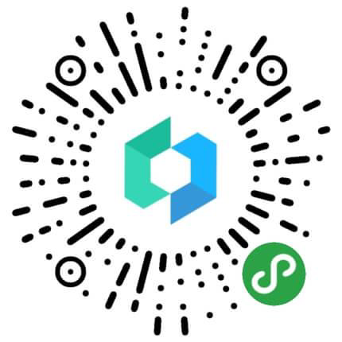
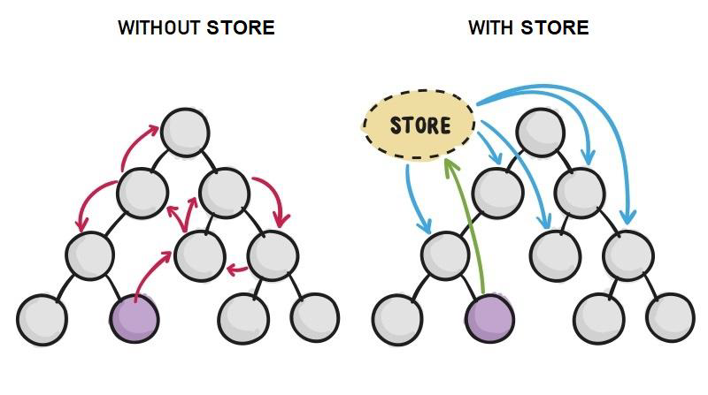
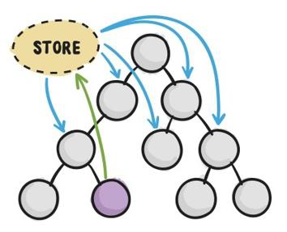
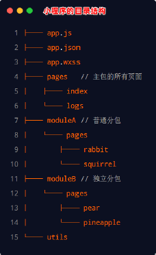

## Vant Weapp

### 小程序对 npm 的支持与限制

小程序中已经支持使用npm 安装第三方包，从而来提高小程序的开发效率。但是，在小程序中使用npm 包有如下 3 个限制：

① 不支持依赖于 Node.js 内置库 的包

② 不支持依赖于 浏览器内置对象 的包

③ 不支持依赖于 C++ 插件 的包

总结：虽然 npm 上的包有千千万，但是能供小程序使用的包却“为数不多”。

### Vant  Weapp

Vant Weapp是有赞前端团队开源的一套 小程序 UI 组件库 ，助力开发者快速搭建小程序应用。它所使用的是MIT 开源许可协议 ，对商业使用比较友好。

官方文档地址 https://youzan.github.io/vant vant-weapp



### 安装 Vant 组件库

在小程序项目中，安装 Vant 组件库主要分为如下 3 步：

① 通过 npm 安装

② 构建 npm 包

③ 修改 app.json

```
# 初始化项目
npm init -y

# 通过 npm 安装
npm i @vant/weapp -S --production

# 通过 yarn 安装
yarn add @vant/weapp --production
```

然后，修改 app.json：

将 app.json 中的 `"style": "v2"` 去除，小程序的[新版基础组件](https://developers.weixin.qq.com/miniprogram/dev/reference/configuration/app.html#style)强行加上了许多样式，难以覆盖，不关闭将造成部分组件样式混乱。

接下来，构建 npm 包：

打开微信开发者工具，点击 **工具 -> 构建 npm**，并勾选 **使用 npm 模块** 选项，构建完成后，即可引入组件。


::: detials typescript 支持：

如果使用 typescript 开发小程序，还需要做如下操作，以获得顺畅的开发体验。

安装 miniprogram-api-typings

```bash
# 通过 npm 安装
npm i -D miniprogram-api-typings

# 通过 yarn 安装
yarn add -D miniprogram-api-typings
```

在 tsconfig.json 中增加如下配置，以防止 tsc 编译报错。

请将`path/to/node_modules/@vant/weapp`修改为项目的 `node_modules` 中 @vant/weapp 所在的目录。

```json
{
  ...
  "compilerOptions": {
    ...
    "baseUrl": ".",
    "types": ["miniprogram-api-typings"],
    "paths": {
      "@vant/weapp/*": ["path/to/node_modules/@vant/weapp/dist/*"]
    },
    "lib": ["ES6"]
  }
}
```

:::

### 使用 Vant  组件

安装完 Vant 组件库之后，可以在 app.json 的 usingComponents 节点中引入需要的组件，即可在 wxml 中 直接使用组件：

```
// app.json
{
  "usingComponents": {
    "van-button": "@vant/weapp/button/index"
  }
}

<!-- 页面的 .wxml 结构 -->
<van-button type="primary">按钮</van-button>
```

### 定制全局基础样式

Vant Weapp
使用 CSS 变量 来实现定制主题。 关于 CSS 变量的基本用法，请参考 MDN 文档： https://developer.mozilla.org/zh-CN/docs/Web/CSS/Using_CSS_custom_properties

```css
.box1 .box2 {
	background-color: #c00000;
}

.box3 {
	color: #c00000;
}
```

vs

```css
html {
 /* 定义 css 变量 */
 --main-color: #c00000;
}

.box1 .box2 {
	background-color: var(--main-color);
}

.box3 {
	color: var(--main-color);
}
```

其中，定义 css 变量是有作用域限制的，全局生效，需要在根节点定义。

### 定制全局主题样式

在 app.wxss 中，写入 CSS 变量：

```css
/* app.wxss */
page {
  /* 定制警告按钮的背景颜色和边框颜色 */
  --button-danger-background-color: #C00000;
  --button-danger-border-color: #D60000;
}
```

## API Promise 化

默认情况下，小程序官方提供的异步 API 都是 基于回调函数 实现的，例如，网络请求的 API 需要按照如下的方式：

```js
wx.request({
  method: '',
  url: '',
  data: { },
  success: () => { }, // 请求成功的回调函数
  fail: () => { }, // 请求失败的回调函数
  complete: () => { } // 请求完成的回调函数
})
```

缺点：容易造成回调地狱 的问题，代码的可读性、维护性差！

::: details 回调函数地狱

“回调地狱”（Callback Hell），也叫“回调函数地狱”，是指在异步编程中，回调函数嵌套过多导致代码结构混乱、难以维护的问题。

------

🔧 为什么会出现回调地狱？

在 JavaScript（特别是早期 Node.js 开发）中，处理异步操作常常依赖回调函数，例如读取文件、访问数据库、发起网络请求等。这些异步操作一层嵌套一层，很快就会变成“地狱式”结构。

------

😖 示例：典型的回调地狱代码

```js
const fs = require('fs');

fs.readFile('a.txt', 'utf8', (err, data1) => {
  if (err) return console.error(err);
  fs.readFile('b.txt', 'utf8', (err, data2) => {
    if (err) return console.error(err);
    fs.readFile('c.txt', 'utf8', (err, data3) => {
      if (err) return console.error(err);
      console.log('合并内容:', data1 + data2 + data3);
    });
  });
});
```

🔻 问题：

- 层层嵌套，难以阅读和维护
- 错误处理分散，每一层都得判断 `err`
- 没有明显的流程结构（像“圣诞树”一样向右缩进）

🎯 场景设定

我们有三个文本文件：`a.txt`, `b.txt`, `c.txt`，我们要**依次读取这三个文件的内容，并把它们拼接输出**。

------

💥 原始的回调地狱代码

```js
const fs = require('fs');

fs.readFile('a.txt', 'utf8', (err, data1) => {
  if (err) return console.error(err);

  fs.readFile('b.txt', 'utf8', (err, data2) => {
    if (err) return console.error(err);

    fs.readFile('c.txt', 'utf8', (err, data3) => {
      if (err) return console.error(err);

      console.log('合并内容:', data1 + data2 + data3);
    });
  });
});
```

------

🧠 逐步拆解解释

第一步：读取 a.txt

```
fs.readFile('a.txt', 'utf8', (err, data1) => {
  if (err) return console.error(err);
  // 下一步读取 b.txt
});
```

这表示：“读取 `a.txt` 成功后，再进行下一步”。

------

第二步：嵌套地读取 b.txt

```
fs.readFile('b.txt', 'utf8', (err, data2) => {
  if (err) return console.error(err);
  // 下一步读取 c.txt
});
```

这个读取操作**必须写在 a.txt 的回调函数里面**，否则你不能保证读取顺序。

------

第三步：嵌套地读取 c.txt

```
fs.readFile('c.txt', 'utf8', (err, data3) => {
  if (err) return console.error(err);
  console.log('合并内容:', data1 + data2 + data3);
});
```

这又是 **嵌套在 b.txt 的回调里面**，完成所有读取后，才打印最终结果。

------

❗问题在哪？

看起来逻辑没错，但代码变成了这样：

```
fs.readFile(..., () => {
  fs.readFile(..., () => {
    fs.readFile(..., () => {
      // 真正的逻辑在这里
    });
  });
});
```

这就是所谓的「回调地狱」：

- 每一步都写在前一步的回调里面
- 向右缩进一层一层一层……像「圣诞树」
- 错误处理也重复写
- 一旦有 5~6 层嵌套，代码几乎不可读

:::

### Api promise 化

API Promise化，指的是通过额外的配置，将官方提供的、基于回调函数的异步 API，升级改造为基于Promise的异步API，从而提高代码的可读性、维护性，避免回调地狱的问题。

```bash
npm install --save miniprogram-api-promise
```

```js
// 在小程序入口文件中(app.js), 只需调用一次 promisifyAll() 方法,
// 即可实现异步 API 的 Promise 化
import { promisifyAll } from 'miniprogram-api-promise'

// 对象是引用类型数据，指向同一个空对象 = 指向同一份内存
const wxp = wx.p = {}

// promisify all wx's api
promisifyAll(wx, wxp)
```

它的作用是：
 👉 **把 wx 对象里的所有异步 API 包装成 Promise 风格，并挂载到 wxp 上，`wxp` 和 `wx.p` 都可以使用 **

### 调用 Promise 优化后的的 api

```html
// 页面的 .wxml 结构
<van-button type="danger" bindtap="getInfo">vant按钮</van-button>

// 在页面的.js 文件中, 定义对应的 tap 事件处理函数
async getInfo() {
  const { data: res } = await wx.p.request({
    method: 'GET',
    url: 'https://www.esccook.cn/api/get',
    data: { name: 'zs', age: 20 }
  })
  console.log(res)
},
```


## 全局数据共享

全局数据共享 （又叫做：状态管理）是为了解决 组件之间数据共享 的问题。开发中常用的全局数据共享方案有：Vuex 、Redux 、MobX 等：



### 小程序中的全局数据共享方案

在小程序中，可使用 mobxmobx-miniprogram 配合 mobxmobx-miniprogramminiprogram-bindings 实现全局数据共享。其中：

- mobxmobx-miniprogram 用来 创建 Store 实例对象
- mobxmobx-miniprogramminiprogram-bindings 用来 把 Store 中的共享数据或方法 ，绑定到组件或页面中使用



### 安装MobX相关的包

```
npm i --save mobx-miniprogram mobx-miniprogram-bindings
```

注意： MobX 相关的包安装完毕之后，记得删除 miniprogram_npm 目录后，重新构建 npm。

### 创建 Mobx 的 store 实例

```js
// /utils/store.js
import { observable, action } from 'mobx-miniprogram'

export const store = observable({
  // 数据字段
  numA: 1,
  numB: 2,
  // 计算属性
  get sum() {
    return this.numA + this.numB
  },
  // actions 方法,用来修改 store 中的数据
  updateNum1: action(function (step) {
    this.numA += step
  }),
  updateNum2: action(function (step) {
    this.numB += step
  }),
})
```

### 绑定到页面&使用

```js
// 页面的 .js 文件
import { createStoreBindings } from 'mobx-miniprogram-bindings'
import { store } from '../../store/store'

Page({
  onLoad: function () { // 生命周期函数--监听页面加载
    this.storeBindings = createStoreBindings(this, {
      store,
      fields: ['numA', 'numB', 'sum'],
      actions: ['updateNum1']
    })
  },
  onUnload: function () { // 生命周期函数--监听页面卸载
    this.storeBindings.destroyStoreBindings()
  }
})
```

```html
// 页面的 .wxml 结构
<view>{{numA}} + {{numB}} = {{sum}}</view>
<van-button type="primary" bindtap="btnHandler1" data-step="{{1}}">
numA + 1
</van-button>
<van-button type="danger" bindtap="btnHandler1" data-step="{{-1}}">
numA - 1
</van-button>

// 按钮 tap 事件的处理函数
btnHandler1(e) {
    this.updateNum1(e.target.dataset.step)
}
```

### 绑定到组件中&使用

```js
// 组件js文件
import { storeBindingsBehavior } from 'mobx-miniprogram-bindings'
import { store } from '../../store/store'

Component({
  behaviors: [storeBindingsBehavior], // 通过 storeBindingsBehavior 来实现自动绑定

  storeBindings: {
    store, // 指定要绑定的 Store
    fields: { // 指定要绑定的字段数据
      numA: () => store.numA, // 绑定字段的第 1 种方式
      numB: (store) => store.numB, // 绑定字段的第 2 种方式
      sum: 'sum' // 绑定字段的第 3 种方式
    },
    actions: { // 指定要绑定的方法
      updateNum2: 'updateNum2'
    }
  },
})
```

```html
// 组件的 .wxml 结构
<view>{{numA}} + {{numB}} = {{sum}}</view>
<van-button type="primary" bindtap="btnHandler2" data-step="{{1}}">
numB + 1
</van-button>
<van-button type="danger" bindtap="btnHandler2" data-step="{{-1}}">
numB - 1
</van-button>

// 组件的方法列表
methods: {
  btnHandler2(e) {
    this.updateNum2(e.target.dataset.step)
  }
}
```

::: details 事件对象 `e` 是什么？

当用户点击按钮时，会触发 `bindtap="btnHandler2"` 绑定的方法 `btnHandler2`，并且小程序会将一个 **事件对象 `e`** 传递给这个方法。

这个事件对象 `e` 中包含了很多信息，比如：

- 触发事件的 DOM 元素（或组件实例）相关信息
- 用户交互的相关数据
- 你通过 `data-*` 自定义属性绑定的数据

------

`e.target.dataset.step` 的含义：

- `e.target`：指的是 **触发事件的那个具体元素节点**，在这里就是你点击的那个 `<van-button>` 按钮。
- `.dataset`：是小程序提供的一个对象，用来获取该元素上所有 `data-*` 自定义属性的值。
- `.step`：指的是 `data-step` 这个自定义属性对应的值。

所以：

```
e.target.dataset.step
```

表示：**获取触发事件的元素上，名为 data-step 的自定义属性的值**。

:::


## 分包

### 基础概念

分包指的是把一个完整的小程序项目，按照需求划分为不同的子包，在构建时打包成不同的分包，用户在使用时按需进行加载。

对小程序进行分包的好处主要有以下两点：

- 可以优化小程序首次启动的下载时间
- 在多团队共同开发时可以更好的解耦协作

分包前，小程序项目中 所有的页面 和资源 都被打包到了一起，导致整个 项目体积过大，影响小程序首次启动的下载时间。


### 分包后的项目构成

分包后，小程序项目由 1 个主包 + 多个分包组成：

- 主包：一般只包含项目的 启动页面 或 TabBar 页面 、以及所有分包都需要用到的一些 公共资源
- 分包：只包含和当前分包有关的页面和私有资源


### 分包的加载规则

① 在小程序启动时，默认会 下载主包 并启动主包内页面

- tabBar 页面需要放到主包中

② 当用户进入分包内某个页面时，客户端会把对应分包下载下来，下载完成后再进行展示

- 非 tabBar 页面可以按照功能的不同，划分为不同的分包之后，进行按需下载

### 分别的体积限制

目前，小程序分包的大小有以下两个限制：

- 整个小程序所有分包大小不超过 16M （主包 + 所有分包）
- 单个分包 /主包大小不能超过 2M

## 使用分包

### 1. 配置方法

<div style="display: flex; gap: 10px;">
    
    
</div>

### 2. 打包原则

① 小程序会按 subpackages 的配置进行分包，subpackages 之外的目录将被打包到主包中

② 主包也可以有自己的 pages（即最外层的 pages 字段）

③ tabBar 页面必须在主包内

④ 分包之间不能互相嵌套

### 3. 引用原则

① 主包无法引用分包内的私有资源

② 分包之间不能相互引用私有资源

③ 分包可以引用主包内的公共资源


## 独立分包

### 1. 概述

独立分包 本质上也是分包，只不过它比较特殊 可以独立于主包和其他分包而单独运行。


最主要的区别： 是否依赖于主包才能运行

- 普通分包必须依赖于主包才能运行
- 独立分包可以在不下载主包的情况下，独立运行

### 使用场景

开发者可以按需，将某些具有一定功能独立性的页面配置到独立分包中。原因如下：

- 当小程序从普通的分包页面启动时，需要首先下载主包
- 而独立分包 不依赖主包即可运行，可以很大程度上提升分包页面的启动速度

注意：一个小程序中可以有多个独立分包。

### 配置方法

<div style="display: flex; gap: 10px;">
    
    
</div>

### 引用原则

独立分包和普通分包以及主包之间，是相互隔绝的，不能相互引用彼此的资源：

① 主包无法引用独立分包内的私有资源

② 独立分包之间，不能相互引用私有资源

③ 独立分包和普通分包之间，不能相互引用私有资源

④ 特别注意：独立分包中不能引用主包内的公共资源

## 分包预下载

分包预下载指的是：在进入小程序的某个页面时，由框架自动预下载可能需要的分包 ，从而提升进入后续分包页面时的启动速度。

### 配置方法

预下载分包的行为，会在进入指定的页面时触发在 app.json 中，使用 preloadRule 节点定义分包的预下载规则，示例代码如下：

```json
{
  "preloadRule": { // 分包预下载的规则
    "pages/contact/contact": { // 触发分包预下载的页面路径
      // network 表示在指定的网络模式下进行预下载,
      // 可选值为: all (不限网络)和 wifi (仅 wifi 模式下进行预下载)
      // 默认值为: wifi
      "network": "all",
      // packages 表示进入页面后,预下载哪些分包
      // 可以通过 root 或 name 指定预下载哪些分包
      "packages": ["pkgA"]
    }
  }
}
```

同一个分包中的页面享有共同的预下载大小限额 2M：

<div style="display: flex; gap: 10px;">
    
    
</div>


## 案例 - 自定义tabBar

> 基础库 2.5.0 开始支持，低版本需做[兼容处理](https://developers.weixin.qq.com/miniprogram/analysis/experience/compatibility.html)。

自定义 tabBar 可以让开发者更加灵活地设置 tabBar 样式，以满足更多个性化的场景。

在自定义 tabBar 模式下：

- 为了保证低版本兼容以及区分哪些页面是 tab 页，tabBar 的相关配置项需完整声明，但这些字段不会作用于自定义 tabBar 的渲染。
- 此时需要开发者提供一个自定义组件来渲染 tabBar，所有 tabBar 的样式都由该自定义组件渲染。推荐用 fixed 在底部的 [cover-view](https://developers.weixin.qq.com/miniprogram/dev/component/cover-view.html) + [cover-image](https://developers.weixin.qq.com/miniprogram/dev/component/cover-image.html) 组件渲染样式，以保证 tabBar 层级相对较高。
- 与 tabBar 样式相关的接口，如 [wx.setTabBarItem](https://developers.weixin.qq.com/miniprogram/dev/api/ui/tab-bar/wx.setTabBarItem.html) 等将失效。
- **每个 tab 页下的自定义 tabBar 组件实例是不同的**，可通过自定义组件下的 `getTabBar` 接口，获取当前页面的自定义 tabBar 组件实例。

**注意：如需实现 tab 选中态，要在当前页面下，通过 `getTabBar` 接口获取组件实例，并调用 setData 更新选中态。可参考底部的代码示例。**

### 1. 配置信息

- 在 `app.json` 中的 `tabBar` 项指定 `custom` 字段，同时其余 `tabBar` 相关配置也补充完整。
- 所有 tab 页的 json 里需声明 `usingComponents` 项，也可以在 `app.json` 全局开启。

示例：

```json
{
  "tabBar": {
    "custom": true,
    "color": "#000000",
    "selectedColor": "#000000",
    "backgroundColor": "#000000",
    "list": [{
      "pagePath": "page/component/index",
      "text": "组件"
    }, {
      "pagePath": "page/API/index",
      "text": "接口"
    }]
  },
  "usingComponents": {}
}
```

### 2. 添加 tabBar 代码文件

在代码根目录下添加入口文件:

```text
custom-tab-bar/index.js
custom-tab-bar/index.json
custom-tab-bar/index.wxml
custom-tab-bar/index.wxss
```

根目录下，创建`custom-tab-bar`文件夹，依此创建完整的index组件文件。

### 3. 编写 tabBar 代码

用自定义组件的方式编写即可，该自定义组件完全接管 tabBar 的渲染。另外，自定义组件新增 `getTabBar` 接口，可获取当前页面下的自定义 tabBar 组件实例。

#### 4. 样式覆盖

样式隔离的相关背景知识请查阅[微信小程序文档](https://developers.weixin.qq.com/miniprogram/dev/framework/custom-component/wxml-wxss.html#组件样式隔离)

Vant Weapp 的所有组件都开启了`addGlobalClass: true`以接受外部样式的影响，可以使用如下 2 种方式覆盖组件样式

> 在页面中使用 Vant Weapp 组件时，可直接在页面的样式文件中覆盖样式

```html
<van-button type="primary">主要按钮</van-button>
/* page.wxss */
.van-button--primary {
  font-size: 20px;
  background-color: pink;
}
```

解除样式隔离

> 在自定义组件中使用 Vant Weapp 组件时，需开启`styleIsolation: 'shared'`选项

```html
<van-button type="primary">主要按钮</van-button>
```

```js
Component({
  options: {
    styleIsolation: 'shared',
  },
});
```

```css
.van-button--primary {
  font-size: 20px;
  background-color: pink;
}
```


## skyline 模式

::: details 🌟 什么是 Skyline 模式？

**Skyline 是微信小程序团队推出的一种新的渲染方案（渲染引擎）**，它基于 **现代前端技术栈（如类 Vue/React 的开发体验）**，并采用了 **更高效的渲染机制**，目标是让小程序：

- **运行更快**
- **开发更灵活**
- **UI 更流畅**
- **支持更复杂的交互和动画**

它是对传统小程序渲染方式的一种 **升级和补充**，并不是完全取代原有模式，而是 **给开发者提供了更多选择**。

------

⚙️ Skyline 模式 vs 传统小程序模式

|     对比维度     |     传统小程序模式（原渲染方式）      |                         Skyline 模式                         |
| :--------------: | :-----------------------------------: | :----------------------------------------------------------: |
|   **渲染引擎**   | 基于 WebView + 自研逻辑层与视图层通信 |           基于更高效的渲染管线，优化了 UI 渲染性能           |
|   **开发体验**   |         使用 WXML + WXSS + JS         | 支持类 Vue/React 风格的开发方式（如使用 Skyline 组件、更灵活的模板语法等） |
|   **性能表现**   |     一般，复杂 UI 或动画可能卡顿      |               更流畅，支持高性能动画与复杂组件               |
|   **组件能力**   |  原生组件有限，自定义组件需手动优化   |        提供更多内置高性能组件，支持更灵活的组件化开发        |
|   **适用场景**   |        适合简单、轻量级小程序         |          适合对性能、交互、UI 复杂度要求高的小程序           |
| **是否默认开启** |        是（传统模式是默认的）         |                否（需要开发者主动开启和适配）                |

------

🛠 如何启用 Skyline 模式？

目前，**Skyline 模式并不是所有小程序都默认支持**，需要满足以下条件：

1. **微信客户端版本支持**：用户需使用较新版本的微信（一般要求微信基础库版本较高，如 2.32.0+，具体以官方文档为准）。
2. **开发者主动开启**：在小程序项目的 `app.json`或页面配置中，通过配置项开启 Skyline 渲染模式。
3. **使用 Skyline 支持的组件和语法**：部分传统 WXML 标签或用法可能不完全兼容，需要按 Skyline 的规范来编写页面。

示例（在 app.json 中启用 Skyline 模式）：

```
{
  "renderer": "skyline",
  "usingComponents": {}
}
```

> ⚠️ 注意：开启后，部分传统小程序标签或功能可能需要调整，具体以微信官方 Skyline 文档为准。

------

✨ Skyline 模式的优势

1. **更快的渲染速度**：优化了 UI 构建和更新流程，页面更流畅，交互响应更迅速。
2. **更丰富的组件能力**：提供更多内置高性能组件，支持复杂布局和动画。
3. **更好的开发体验**：支持更灵活的模板语法，类 Vue/React 开发模式，提高开发效率。
4. **支持复杂交互与动画**：适合游戏化小程序、营销活动页、电商详情页等对性能要求高的场景。

:::

使用 skyline 渲染模式的时候，需要进行如下适配：

### 1. tabBar 组件样式兼容

- tabBar 根组件需要添加 `pointer-events: auto`
- tabBar 根组件定位需为 `position: absolute`

```html
<view class="tab-bar">
  <!-- tabbar item-->
</view>
.tab-bar {
  pointer-events: auto;
  position: absolute;
}
```

### 2. getTabBar 回调函数

skyline 模式下，页面/组件上的 `getTabBar` 接口为异步回调的方式获取 tabBar 实例

```js
Page({
  getInstance() {
    if (typeof this.getTabBar === 'function' ) {
      this.getTabBar((tabBar) => {
        tabBar.setData({
          selected: 0
        })
      })
    }
  }
})
```
