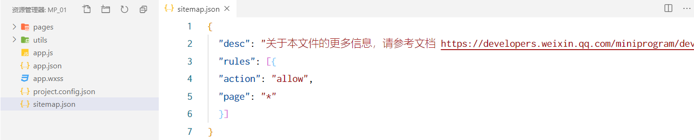
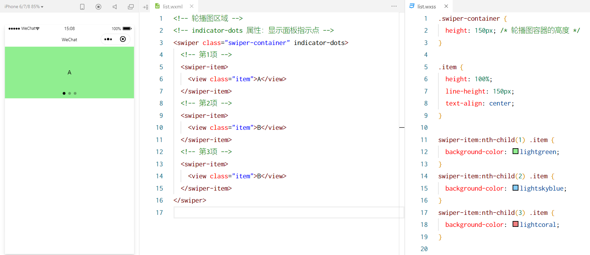
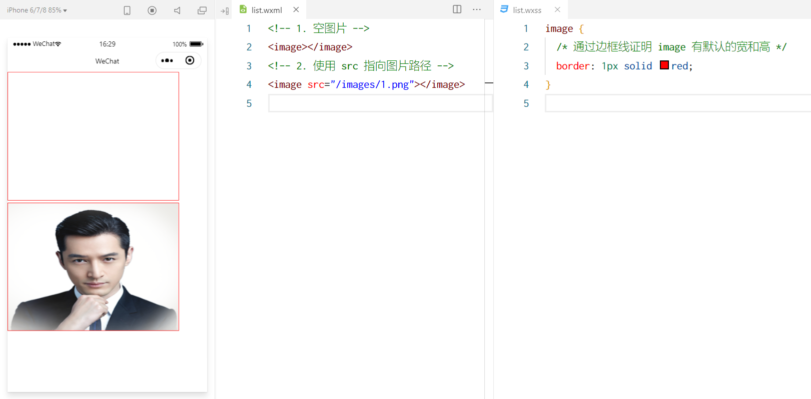

## 1. 项目结构

- ① pages 用来存放所有小程序的页面
- ② utils 用来存放工具性质的模块（例如：格式化时间的自定义模块）
- ③ app.js 小程序项目的入口文件
- ④ app.json 小程序项目的全局配置文件
- ⑤ app.wxss 小程序项目的全局样式文件
- ⑥ project.config.json 项目的配置文件
- ⑦ sitemap.json 用来配置小程序及其页面是否允许被微信索引

## 2. 页面组成

小程序官方建议把所有小程序的页面，都存放在pages 目录 中，以 单独的文件夹 存在，如图所示：


其中，每个页面 由 4 个基本文件 组成，它们分别是：

- ① .js 文件（页面的脚本文件，存放页面的数据、事件处理函数等）
- ② .json 文件（当前页面的配置文件，配置窗口的外观、表现等）
- ③ .wxml 文件（页面的模板结构文件）
- ④ .wxss 文件（当前页面的样式表文件）

### 2.1 json配置文件

JSON是一种数据格式 ，在实际开发中 JSON 总是以 配置文件 的形式出现。小程序项目中也不例外：通过不同的 .json 配置文件，可以对小程序项目进行不同级别的配置。小程序项目中有 4 种 json 配置文件，分别是：

- ① 项目根录中的 app.json 配置文件
- ② 项目根录中的 project.config.json 配置文件
- ③ 项目根录中的 sitemap.json 配置文件
- ④ 每个页面文件夹中的 .json 配

#### 2.1.1 app.json 文件

app.json是当前小程序的 全局配置 ，包括了小程序的 所有页面路径 、窗口外观、界面表现 、底部 tab 等。 Demo 项目里边的 app.json 配置内容如下：


- ① pages ：用来记录当前小程序所有页面的路径
- ② window ：全局定义小程序所有页面的背景色、文字颜色等
- ③ style ：全局定义小程序组件所使用的样式版本
- ④ sitemapLocation ：用来指明 sitemap.json 的

#### 2.1.2 project.config.json文件

project.config.json 是项目配置文件，用来记录我们 对小程序开发工具所做的个性化配置 ，例如：

- setting 中保存了 编译相关的配置
- projectname 中保存的是 项目名称
- appid 中保存的是 小程序的账号 ID

#### 2.1.3 sitemap.json 文件

微信现已开放 小程序内搜索 ，效果类似于 PC 网页的 SEO 。sitemap.json 文件用来 配置小程序页面是否允许
微信索引 。
当开发者允许微信索引时，微信会通过爬虫的形式，为小程序的页面内容建立索引。当用户的搜索关键字和页
面的索引匹配成功的时候，小程序的页面将可能展示在搜索结果中。



注意： sitemap 的索引提示是默认开启的，如需要关闭 sitemap 的索引提示，可在小程序项目配置文件
project.config.json 的 setting 中配置字段 checkSiteMap 为 false。

#### 2.1.4 页面的 .json 配置文件

小程序中的每一个页面，可以使用.json 文件来 对本页面的窗口外观进行配置 ，页面中的配置项会覆盖app.json 的 window 中相同的配置项 。例如：


#### 2.1.5新建项目页面

只需要在 app.json -> pages 中新增页面的存放路径，小程序开发者工具即可帮我们自动创建对应的页面文件，
如图所示：


#### 2.1.6修改项目首页

只需要调整 app.json -> pages 数组中页面路径的前后顺序，即可修改项目的首页。小程序会把排在第一位的页
面，当作项目首页进行渲染，如图所示：


### 2.2 wxml 模板

WXML（WeiXin Markup Language ）是小程序框架设计的一套 标签语言 ，用来构建小程序页面的结构 ，其作
用类似于网页开发中的 HTML 。

#### 2.2.1WXML和 HTML 的区别

① 标签名称不同

- HTML （div, span, img , a a）
- WXMLWXML（view, text, image, navigator navigator）

② 属性节点不同

```html
- <a href="#">超链接</a>

- <navigator url="/pages/home/home"></navigator>
```

③ 提供了类似于 Vue 中的模板语法

- 数据绑定
- 列表渲染
- 条件渲染

### 2.3 wxss 样式

WXSS (WeiXin Style Sheets)是一套 样式语言 ，用于描述 WXML 的组件样式，类似于网页开发中的 CSS 。

WXSS和 CSS 的区别：
① 新增了 rpx 尺寸单位

- CSS 中需要手动进行像素单位换算，例如 rem
- WXSS 在底层支持新的尺寸单位 rpx ，在不同大小的屏幕上小程序会自动进行换算

② 提供了全局的样式和局部样式

- 项目根录中的 app.wxss 会作用于所有小程序页面
- 局部页面的 .wxss 样式仅对当前页面生效

③ WXSS 仅支持部分 CSS 选择器

- .class 和 #id
   element
   并集选择器、后代选择器
   ::after 和 ::before 等伪类选择器

### 2.4 .js 文件

小程序中的 JS 文件分为三大类，分别是：

- ① app.js - 是整个小程序项目的入口文件 ，通过调用 App() 函数 来启动整个小程序
- ② 页面的 .js 文件 - 是页面的入口文件 ，通过调用 Page() 函数 来创建并运行页面
- ③ 普通的 .js 文件 - 是普通的功能模块文件 ，用来封装 公共的函数或属性 供页面使用

## 3. 小程序的宿主环境

是小程序的宿主环境 ，如图所示：


小程序 借助宿主环境提供的能力 ，可以完成许多普通网页无法完成的功能，例如：微信扫码、微信支付、微信登录、地理定位、etc…

宿主环境包含的内容：① 通信模型  ② 运行机制  ③ 组件  ④ API

### 3.1 通信的主体

小程序中通信的主体是 渲染层 和逻辑层 ，其中：
① WXML 模板和 WXSS 样式工作在渲染层
② JS 脚本工作在逻辑层


### 3.2 通信模型

小程序中的通信模型分为两部分：

- ① 渲染层和逻辑层之间的通信 => 由微信客户端进行转发
- ② 逻辑层和第三方服务器之间的通信 => 由微信客户端进行转发

### 3.3 运行机制

小程序启动的过程：

- ① 把小程序的代码包下载到本地
- ② 解析 app.json 全局配置文件
- ③ 执行 app.js 小程序入口文件， 调用 App() 创建小程序实例
- ④ 渲染小程序首页
- ⑤ 小程序启动完

页面渲染的过程：

- ① 加载解析页面的 .json 配置文件
- ② 加载页面的 .wxml 模板和 .wxss 样式
- ③ 执行页面的 .js 文件， 调用 Page() 创建页面实例
- ④ 页面渲染完成

### 3.4  组件

#### 3.4.1 组件分类

小程序中的组件也是由宿主环境提供的，开发者可以基于组件快速搭建出漂亮的页面结构。官方把小程序的组件分为了 9 大类，分别是：

- ① 视图容器
- ② 基础内容
- ③ 表单组件
- ④ 导航组件
- ⑤ 媒体组件
- ⑥ map 地图组件
- ⑦ canvas 画布组件
- ⑧ 开放能力
- ⑨ 无障碍访问

#### 3.4.2 常用的视图容器分类组件

① view

- 普通视图区域
- 类似于 HTML 中的 div ，是一个块级元素
- 常用来实现页面的布局效果

② scrollscroll-view

- 可滚动的视图区域
- 常用来实现滚动列表效果

③ swiper 和 swiperswiper-item

- 轮播图容器组件 和 轮播图 item 组

#### 3.4.3 view 组件的基本使用

实现如图的flex布局效果：


#### 3.4.4 scroll-view 的基本使用

纵向滚动效果：


#### 3.4.5 swiper 和 swiper-item 组件的基本使用

轮播效果：



#### 3.4.6 swiper 的常用属性

|          属性名           |    类型     |        默认值         |                             说明                             |
| :-----------------------: | :---------: | :-------------------: | :----------------------------------------------------------: |
|     `indicator-dots`      |   Boolean   |        `false`        |                      是否显示面板指示点                      |
|     `indicator-color`     |   String    | `'rgba(0, 0, 0, .3)'` |                          指示点颜色                          |
| `indicator-active-color`  |   String    |      `'#000000'`      |                     当前选中的指示点颜色                     |
|        `autoplay`         |   Boolean   |        `false`        |                         是否自动切换                         |
|        `interval`         |   Number    |        `3000`         |                自动切换时间间隔（单位：毫秒）                |
|        `duration`         |   Number    |         `500`         |                  滑动动画时长（单位：毫秒）                  |
|        `circular`         |   Boolean   |        `false`        |                 是否采用衔接滑动（循环切换）                 |
|        `vertical`         |   Boolean   |        `false`        |                滑动方向是否为纵向（默认横向）                |
|     `previous-margin`     |   String    |        `'0px'`        |    前边距，可用于露出前一项的一小部分（支持 `rpx`/`px`）     |
|       `next-margin`       |   String    |        `'0px'`        |    后边距，可用于露出后一项的一小部分（支持 `rpx`/`px`）     |
| `display-multiple-items`  |   Number    |          `1`          |          同时显示的滑块数量（默认 `1`，最多 `10`）           |
| `skip-hidden-item-layout` |   Boolean   |        `false`        |             是否跳过未显示的滑块布局（提升性能）             |
|       `bindchange`        | EventHandle |           -           | `current` 改变时触发的事件（事件对象 `e.detail.current` 为当前索引） |
|     `bindtransition`      | EventHandle |           -           |                   滑动动画开始时触发的事件                   |
|   `bindanimationfinish`   | EventHandle |           -           |                   滑动动画结束时触发的事件                   |

以下是 **微信小程序 Swiper 组件** 的常用属性表格（基于 `swiper` 组件的官方文档）：

|          属性名           |    类型     |        默认值         |                             说明                             |
| :-----------------------: | :---------: | :-------------------: | :----------------------------------------------------------: |
|     `indicator-dots`      |   Boolean   |        `false`        |                      是否显示面板指示点                      |
|     `indicator-color`     |   String    | `'rgba(0, 0, 0, .3)'` |                          指示点颜色                          |
| `indicator-active-color`  |   String    |      `'#000000'`      |                     当前选中的指示点颜色                     |
|        `autoplay`         |   Boolean   |        `false`        |                         是否自动切换                         |
|        `interval`         |   Number    |        `3000`         |                自动切换时间间隔（单位：毫秒）                |
|        `duration`         |   Number    |         `500`         |                  滑动动画时长（单位：毫秒）                  |
|        `circular`         |   Boolean   |        `false`        |                 是否采用衔接滑动（循环切换）                 |
|        `vertical`         |   Boolean   |        `false`        |                滑动方向是否为纵向（默认横向）                |
|     `previous-margin`     |   String    |        `'0px'`        |    前边距，可用于露出前一项的一小部分（支持 `rpx`/`px`）     |
|       `next-margin`       |   String    |        `'0px'`        |    后边距，可用于露出后一项的一小部分（支持 `rpx`/`px`）     |
| `display-multiple-items`  |   Number    |          `1`          |          同时显示的滑块数量（默认 `1`，最多 `10`）           |
| `skip-hidden-item-layout` |   Boolean   |        `false`        |             是否跳过未显示的滑块布局（提升性能）             |
|       `bindchange`        | EventHandle |           -           | `current` 改变时触发的事件（事件对象 `e.detail.current` 为当前索引） |
|     `bindtransition`      | EventHandle |           -           |                   滑动动画开始时触发的事件                   |
|   `bindanimationfinish`   | EventHandle |           -           |                   滑动动画结束时触发的事件                   |

------

**子组件 `swiper-item` 的属性**：

|  属性名   |  类型  |                      说明                      |
| :-------: | :----: | :--------------------------------------------: |
| `item-id` | String | 该项的唯一标识（用于 `scroll-into-view` 定位） |

------

**示例代码**：

```html
<swiper
  indicator-dots="{{true}}"
  autoplay="{{true}}"
  interval="3000"
  duration="500"
  circular="{{true}}"
  vertical="{{false}}"
  bindchange="swiperChange"
>
  <swiper-item>
    <view>Slide 1</view>
  </swiper-item>
  <swiper-item>
    <view>Slide 2</view>
  </swiper-item>
  <swiper-item>
    <view>Slide 3</view>
  </swiper-item>
</swiper>
```

#### 3.4.7 常用的基础内容组件

① text

- 文本组件
- 类似于 HTML 中的 span 标签，是一个行内元素

通过 text 组件的 selectable 属性，实现长按选中文本内容的效果：


② richrich-text

- 富文本组件
- 支持把 HTML 字符串渲染为 WXML 结构

通过 richrich-text 组件的 nodes 属性节点， 把 HTML 字符串渲染为对应的 UI 结构 ：


#### 3.4.8 其他常用组件

① button

- 按钮组件
- 功能比 HTML 中的 button 按钮丰富
- 通过 openopen-type 属性可以调用微信提供的各种功能（客服、转发、获取用户授权、获取用户信息等）

② image

- 图片组件
- image 组件默认宽度约 300px 、高度约 240px

③ navigator 

- 页面导航组件
- 类似于 HTML 中的 a 链接

#### 3.4.9 button 的基本使用



#### 3.4.10 image 组件的 mode 属性

image 组件的 mode 属性用来指定图片的 裁剪 和缩放 模式，常用的 mode 属性值：

|   `mode` 值    |  类型  |                             说明                             |
| :------------: | :----: | :----------------------------------------------------------: |
| `scaleToFill`  | String | **缩放模式**：不保持纵横比缩放图片，使图片的宽高完全拉伸至填满组件。 |
|  `aspectFit`   | String | **缩放模式**：保持纵横比缩放图片，使图片的长边能完全显示出来（可能留白）。 |
|  `aspectFill`  | String | **缩放模式**：保持纵横比缩放图片，只保证图片的短边能完全显示出来（可能裁剪）。 |
|   `widthFix`   | String | **缩放模式**：宽度不变，高度自动变化，保持原图宽高比（需确保 `width` 已设置）。 |
|     `top`      | String | **裁剪模式**：不缩放图片，只显示图片的顶部区域（需配合 `height` 使用）。 |
|    `bottom`    | String |       **裁剪模式**：不缩放图片，只显示图片的底部区域。       |
|    `center`    | String |       **裁剪模式**：不缩放图片，只显示图片的中间区域。       |
|     `left`     | String |       **裁剪模式**：不缩放图片，只显示图片的左边区域。       |
|    `right`     | String |       **裁剪模式**：不缩放图片，只显示图片的右边区域。       |
|   `top left`   | String |      **裁剪模式**：不缩放图片，只显示图片的左上角区域。      |
|  `top right`   | String |      **裁剪模式**：不缩放图片，只显示图片的右上角区域。      |
| `bottom left`  | String |      **裁剪模式**：不缩放图片，只显示图片的左下角区域。      |
| `bottom right` | String |      **裁剪模式**：不缩放图片，只显示图片的右下角区域。      |

------

**分类总结**：

1. **缩放模式**（保持纵横比，可能留白或填满）：
   - `scaleToFill`（拉伸填满，可能变形）
   - `aspectFit`（完整显示图片，可能留白）
   - `aspectFill`（完整显示短边，可能裁剪长边）
   - `widthFix`（宽度固定，高度按比例自适应）
2. **裁剪模式**（不缩放图片，直接裁剪显示部分区域）：
   - `top` / `bottom` / `center` / `left` / `right`（单方向裁剪）
   - `top left` / `top right` / `bottom left` / `bottom right`（四角裁剪）

------

**使用示例**：

```html
<image 
  src="https://example.com/image.jpg" 
  mode="aspectFill" 
  style="width: 300px; height: 200px;"
/>
```

**关键说明**：

1. **`scaleToFill`**：
   - 图片会被拉伸以填满组件，可能导致变形（不推荐用于需要保持比例的场景）。
2. **`aspectFit`**：
   - 图片完整显示，但可能留白（适合需要完整展示图片内容的场景，如头像）。
3. **`aspectFill`**：
   - 图片短边完整显示，长边可能被裁剪（适合需要焦点展示的场景，如封面图）。
4. **`widthFix`**：
   - 需明确设置 `width`，高度会按原图比例自动计算（适合瀑布流布局）。
5. **裁剪模式**：
   - 适用于固定尺寸容器中显示图片的特定部分（如圆形头像需配合 `border-radius: 50%`）。


## 4. api

### 4.1 概述

小程序中的 API 是由宿主环境提供的 ，通过这些丰富的小程序 API ，开发者可以方便的调用微信提供的能力例如：获取用户信息、本地存储、支付功能等。

### 4.2 三大分类

小程序官方把 API 分为了如下 3 大类：
① 事件监听 API

- 特点：以 on 开头，用来 监听某些事件的触发
- 举例： wx.onWindowResize (function callback) 监听窗口尺寸变化的事件

② 同步 API

- 特点 1：以 Sync 结尾的 API 都是同步 API
- 特点 2：同步 API 的执行结果，可以通过函数返回值直接获取，如果执行出错会抛出异常
- 举例： wx.setStorageSync ('key', 'value') 向本地存储中写入内容

③ 异步 API

- 特点：类似于 jQuery 中的 $.ajax(options) 函数，需要通过 success 、fail 、complete 接收调用的结果
- 举例： wx.requestrequest() 发起网络数据请求，通过 success 回调函数接收据

